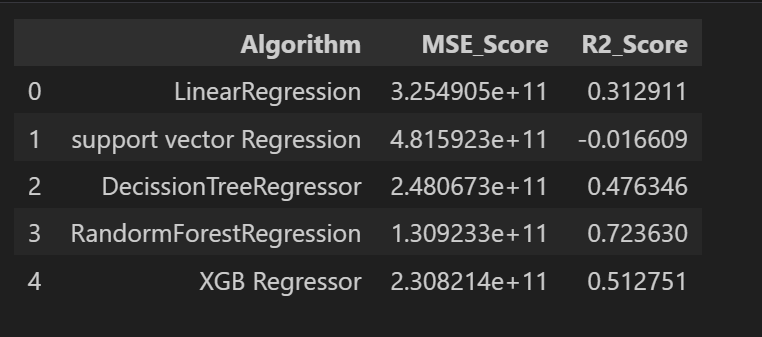

# Payment Date Prediction

## Models Selected

### The following regression models were evaluated to determine the best-performing model:

- Linear Regression
- Decision Tree Regression
- Random Forest Regression
- Support Vector Regression
- Extreme Gradient Boost Regression (XGBoost)

### Model Performance Comparison

### **Best Model Selected: Random Forest Regressor**

## **Reason for Choosing Random Forest Regressor**

After evaluating five different machine learning models, **Random Forest Regressor** was selected as the best model based on performance metrics. While **XGBoost** also showed competitive results, Random Forest outperformed it in accuracy and generalization.

### **Key Reasons for Selection:**

1. **High Efficiency & Robustness**: Random Forest is effective for handling large datasets and reduces overfitting through ensemble learning, leading to better generalization.

2. **Superior Performance on Tabular Data**: It excels in structured datasets, making it a strong choice for predictive modeling tasks like this one.

3. **Higher R² Score**: From the comparison table, Random Forest Regressor has the **highest R² Score (0.723630)**, indicating that it better fits the data compared to the other models.

4. **Lowest Mean Squared Error (MSE)**: A lower MSE score signifies better prediction accuracy, and Random Forest had the lowest MSE among all evaluated models.

For these reasons, **Random Forest Regressor** was chosen as the final model.

---

## **Hyperparameter Tuning with RandomizedSearchCV**

After performing hyperparameter tuning, the updated performance metrics for **Random Forest Regressor** are as follows:

- **MSE Score:** 1.483841e+11
- **R² Score:** 0.686771

### **Conclusion**

Hyperparameter tuning resulted in a slight decrease in the **R² Score**. This indicates that further fine-tuning of hyperparameters is necessary. Alternatively, considering a different model, such as **XGBoost**, might yield better results.

Further optimization and experimentation are needed to ensure the best possible prediction accuracy.

